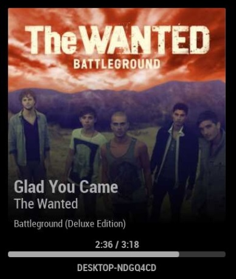
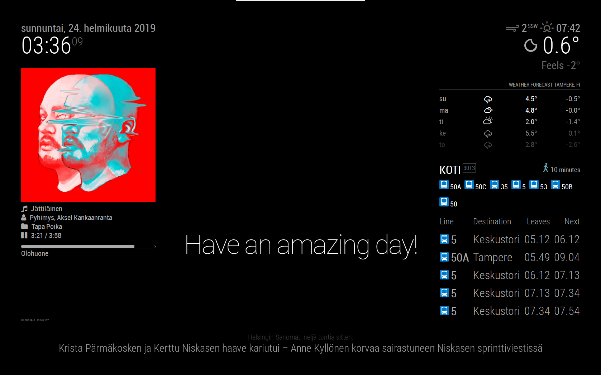

# MagicMirror_config
Konffitiedostot MagicMirror projektiin. Toimii myös infoscreeninä esim. Raspberry Pi virallisen näytön kanssa.


## Setup
Asennettu viimeisin Raspbian Stretch with Desktop, ei recommended software https://www.raspberrypi.org/downloads/raspbian/.

Siirretty .img tiedosto 32Gb microSD-kortille Etcherillä https://www.balena.io/etcher/.

**HUOM!** Vaaditaan tästä eteenpäin setuppaamiseen näppäimistö, hiiri ja näyttö ellet hoida asioita SSH:n kautta terminaalilla lisäämällä SD-kortin juureen tiedosto "ssh" ilman tiedostopäätettä ennen sen asettamista raspiin etchauksen jälkeen

Raspbian-configilla vaihdetaan kieliasetukset kuntoon, vaihdetaan salasana(tai `passwd`) ja enabloidaan sekä VNC että SSH.
Oletuksena käyttäjänä on pi ja salasana raspberry (:D).

Päivitetään Raspbian
```bash
sudo apt update
sudo apt upgrade 
```
WiFin laittaminen, ettei tarvitse olla kaapelin päässä:
```bash
sudo nano /etc/wpa_supplicant/wpa_supplicant.conf
#Lisää seuraava(t)
network={
	ssid="DemoLuola"		#wifin nimi
	psk="Demopartyistaparhain"	#wifisalasana
}
#network={...
```

Ladattu MagicMirror2 käyttäen skriptiä https://magicmirror.builders/.

## Configuring
Konffi-kohdat viittaavat tiedostoon ~/MagicMirror/config/config.js.

### Screensaver pois

Kokeiltu summamutikassa https://www.raspberrypi.org/forums/viewtopic.php?f=91&t=57552.

Kopioi repon file lightdm.conf polkuun /etc/lightdm/lightdm.conf TAI lisää itse puuttuva rivi [Seat:*] alle
```bash
sudo cp lightdm.conf /etc/lightdm/lightdm.conf
#TAI lisää itse rivi samaan tiedostoon [Seat:*] alle:
xserver-command=X -s 0 dpms
```
JA reboot.

### HSL pysäkit

Ladattu HSL moduuli https://github.com/0EQUALIZERO/MMM-Hsl-stops.
- korjattu ikonit toimimaan korjaamalla hsl_stops.js (LISÄTTY REPOON 24.2.2019) 
```bash
cd ~/MagicMirror/modules
git clone https://github.com/0EQUALIZERO/MMM-Hsl-stops.git
cd MMM-Hsl-stops
npm install
```
#### Konffi
- konfiguroitu käyttämään koko suomen reittiopasta HSL sijasta (kts. konffi)
- oman pysäkin löytää https://beta.digitransit.fi kaivamalla oma pysäkki ja ottamalla pysäkin URLista numero %3A jälkeen
```
                {
                        module: 'MMM-Hsl-stops',
                        position: 'top_right',
                        config: {
                        stopId: 'HSL:1070425',  // Id of the stop you want to display, give id test to use test data JSON
                        debug: false, // Increase log output
                        testMode: false, // Activate module in test-mode using provided static JSON test data
                        testJSON: 'test',
                        hurryTime: 2, // In minutes apply hurrytime is passenger has to hurry, 0-x minutes
                        stopNickName: 'TARKKIS', // Personalize stop name with a nickname
                        routeIdFilter: [], // Routes filters, retain only the routes listed here
                        maxListedDepartures: '4', // Max number of departures listed on screen
                        maxFetchedDepartures: '100', // Max number of departures fetched from API to dataset
                        timeRange: 12 * 60 * 60, // Range of trips to be polled in seconds
                        timeToStop: 2, // Time to get to the stop in minutes
                        humanizeTimeTreshold: 15,
                        apiUrl: 'https://api.digitransit.fi/routing/v1/routers/finland/index/graphql' // HSL digirtransit API url        
                        }
                },
```

### Sää
Oletuksena mukana tulee OpenWeathermapia käyttävä tämän hetkinen sää ja ennuste.
Käyttääkseen täytyy hakea API key https://home.openweathermap.org/users/sign_up joka syötetään configiin.
Lisäksi voi hakea oman kaupunkinsa openweathermapista: esim. Helsinki: https://openweathermap.org/city/658225 eli 658225 on ID.
#### Konffi
```
                {
                        module: "weatherforecast",
                        position: "top_left",
                        header: "Weather Forecast",
                        config: {
                                location: "Helsinki",
                                locationID: "658225",  //ID from https://openweathermap.org/city
                                appid: "<APPID eli API KEY TÄHÄN>"
                        }
                },
#ja sama myös currentweatherille
```

### Spotify Nyt Soi
aka MMM-NowPlayingOnSpotify (https://github.com/raywo/MMM-NowPlayingOnSpotify)
```bash
cd ~/MagicMirror/modules
git clone https://github.com/raywo/MMM-NowPlayingOnSpotify.git
cd MMM-NowPlayingOnSpotify
npm install
```
#### Konffi
Täytyy mennä https://developer.spotify.com/dashboard/ ja luoda uusi app. Appille pitää asettaa http://localhost:8080/callback Redirect URIksi.
Ota talteen ClientID ja ClientSecret.
Tee seuraava VNC:llä tai RasPin näppis+näyttö yhdistelmällä.
```bash
cd authorization
node app
#Selain avautuu, syötä ClientID ja clientSecret. Pyytää vielä kirjautumaan spotifyyn.
#Saat konffin lopuksi, mikä pitää syöttää ~/MagicMirror/config/config.js
```

#### Spotify Tweaking

Spotify UI paranneltu kun module ei ole käytössä 
- Modulen käynnistyksen aikana oleva logo poistettu
```bash
cd ~/MagicMirror/modules/MMM-NowPlayingOnSpotify/css 
nano styles.css
```
```css
#.NPOS_initContent alle
display: none;

#.NPOS_loading alle
display: none;
```	

- Module ei käytössä logo poistetu
```
cd ~/MagicMirror/modules/MMM-NowPlayingOnSpotify/css 
nano css/styles
#.NPOS_nothingIsPlayingContent
display: none;
```

- Spotifyn modulen ulkonäön muokkailua käyttämällä käyttäjän "XusBadia" luomaa ulkonäköä.  "XusBadin" julkaisemaan ulkonäköön pääsee tästä (https://github.com/raywo/MMM-NowPlayingOnSpotify/issues/27). Koodin voi suoraan kopioida ~/MagicMirror/css/cusotm.css ja ulkonäkö vaihtuu  refreshin jälkeen. 
- Ulkonäköä tuli muokattua tyydyttämään omaa makua. Muutoksiin kuuluui artistin ja kappaleen nimen suurennusta sekä aikapalkin pyöristymistä.

### Konffi
Omat muutokset alkuperäiseen koodiin.
```css  
#Kappaleen nimen suurennus
        
        .NPOS_infoText:nth-child(2){
        font-weight: 600;
        font-size: 150%;
        margin-bottom: 5px;
        }

#Artistin nimen suurennus
        
        .NPOS_infoText:nth-child(3){
        font-weight: 400;
        font-size: larger;
        }

#Aikapalkin pyöristäminen

        progress.NPOS_progress::-webkit-progress-value{
        border-radius: 4px;
        }

```

Modulen ulkonäkö muutosten jälkeen



### IP:n näyttäminen ruudulla

IP:n kaivaminen on aika aamuinen homma, joten kiva olisi näyttää sitä näytöllä omalla modulellaan.
Ladattu MMM-ip (https://github.com/fewieden/MMM-ip) ja asetettu seuraava konffiin.
```
cd ~/MagicMirror/modules
git clone https://github.com/fewieden/MMM-ip.git
cd MMM-ip
npm install
```
#### Konffi
Halutaan vain IPv4 osoite
```
                {
                        module: 'MMM-ip',
                        position: 'bottom_left',
                        config: {
                                fontSize: '8',
                                showFamily: 'IPv4'
                        }
                },
```
__________
TODO 
- korjattava HSL moduulin ajat sekä HTTP-ongelma (https://github.com/0EQUALIZERO/MMM-Hsl-stops/pull/2)
- spotify presonal tweak (UI styling)
- näytön ajastus pois yön ajaksi
- possibly kellon ja weathernowforecast fonttia isommaks
- herpsderps

## Kuva

